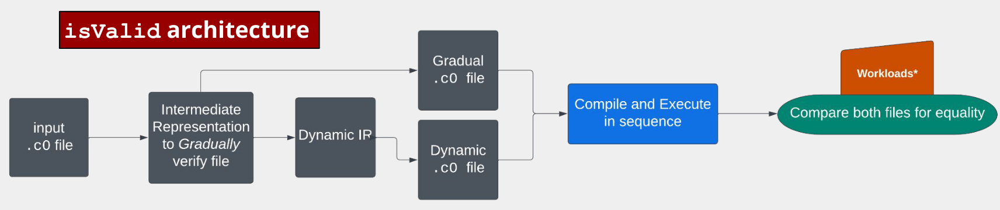

# `isValid` architecture diagram

**1**. External Structure: `input.c0` file -> match `main.scala` `Config.Checker` -> call isValid:`gvc/pbt/Checker.scala`

**2**. isValid: `main.generateIR()`
   1. First Branch: `main.verify` -> gradual `.c0` file -> queue wait in compile & execute
   2. Second Branch: `BaselineChecker.check()` & `onlyFraming = false` -> Dynamic IR -> `IRPrinter.print` & `includeSpecs = false` -> queue into compile & execute

**3**. Compile and Execute with `--stress`

**4**. `.equals` string comparison and output